## About Me

<!-- Swap the src below for a .gif any time you find one you like better. -->

Right now I'm deep into competitive programming, solving problems most days and
picking up new algorithms along the way.

I'm also learning backend development, mostly by building small projects and
figuring things out as I break them.

 

## Tech

<table>
  <tr>
    <td valign="top" width="34%">
      <b>Languages</b>
        
      
    </td>
    <td valign="top" width="33%">
      <b>Backend &amp; Data</b>
        
      
        
      
    </td>
    <td valign="top" width="33%">
      <b>Tools &amp; Platforms</b>
        
      
    </td>
  </tr>
</table>

## Problem Solving

  
  

## GitHub

  
  

<picture>
  <source media="(prefers-color-scheme: dark)" srcset="github-miner.svg" />
  <source media="(prefers-color-scheme: light)" srcset="github-miner-light.svg" />
  
</picture>

## Connect

  
  <!-- Portfolio is not live yet - swap the "#" below for the real URL when it is. -->
  
  

